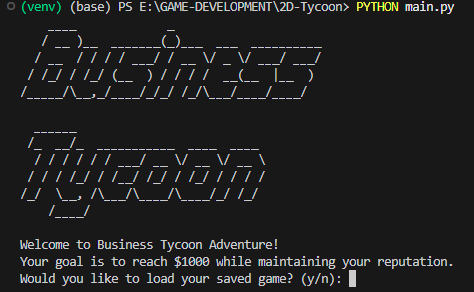
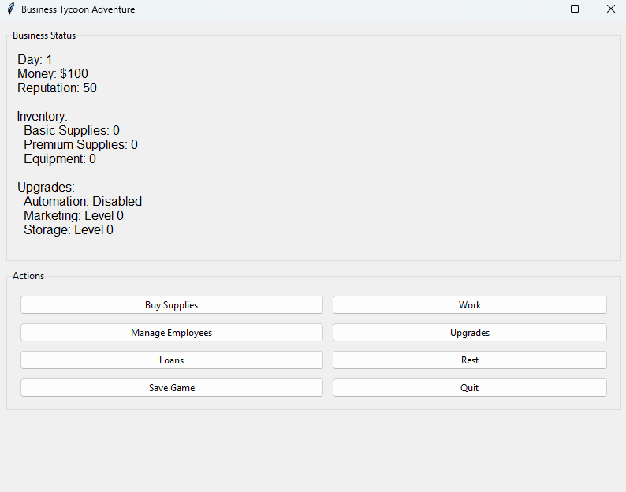

# User Interface Documentation

Business Tycoon Adventure offers two interface options: a Command Line Interface (CLI) and a Graphical User Interface (GUI).

## Command Line Interface (CLI)

The CLI provides a classic text-based gaming experience with colored output and ASCII art.



### CLI Features
- Colored text using ANSI colors for better readability
- ASCII art title and business map
- Progress bars for money and reputation
- Real-time status updates with color-coded information
- Clear menu structure with numbered options
- Visual feedback for actions (green for positive, red for negative)
- Business map with live status indicators

### CLI Controls
- Use number keys (1-8) to select menu options
- Follow on-screen prompts for input
- Press Enter to confirm actions
- Type 'quit' or select option 8 to exit

## Graphical User Interface (GUI)

The GUI offers a modern, point-and-click experience using tkinter.



### GUI Features
- Clean, modern window layout with ttk widgets
- Progress bars for money and reputation tracking
- Real-time business status display
- Tooltips for all buttons and controls
- Modal dialog windows for actions
- Visual feedback for transactions
- Interactive business map

### GUI Controls
#### Mouse Controls
- Click buttons to perform actions
- Use dialog windows for detailed interactions
- Hover over buttons for tooltips

#### Keyboard Shortcuts
- `Ctrl+S`: Save game
- `Ctrl+Q`: Quit game
- `F1`: Show help
- `F2`: Show business map

### Dialog Windows
The GUI includes specialized dialog windows for:
1. **Buy Supplies**
   - Supply type selection
   - Amount input
   - Real-time cost calculation
   - Storage capacity check

2. **Employee Management**
   - Current employee count
   - Hire/fire options
   - Salary information
   - Employee capacity limits

3. **Upgrades**
   - Automation system
   - Marketing campaigns
   - Storage expansions
   - Current level display

4. **Loan Management**
   - Current loan status
   - Take/pay loan options
   - Interest rate display
   - Maximum loan limits

## Business Map
Both interfaces feature an ASCII business map showing:
```
┌──────────────────────────┐
│     BUSINESS TYCOON      │
├──────────────────────────┤
│┌─────────┐  ┌─────────┐ │
││Office   │  │0/50     │ │
│└─────────┘  └─────────┘ │
│                         │
│┌─────────┐  ┌─────────┐ │
││Market   │  │Research │ │
│└─────────┘  └─────────┘ │
│                         │
│ ■ □ □      ┌─────────┐ │
│ Employees  │NONE     │ │
│            └─────────┘ │
└──────────────────────────┘
```

### Map Legend
- `■`: Active employee
- `□`: Available employee slot
- Storage shows current/maximum capacity
- Upgrades section shows active improvements

## Switching Between Interfaces

- For CLI: `python main.py`
- For GUI: `python main.py --gui`

Both interfaces share the same game logic and save file format, allowing players to switch between them at will.